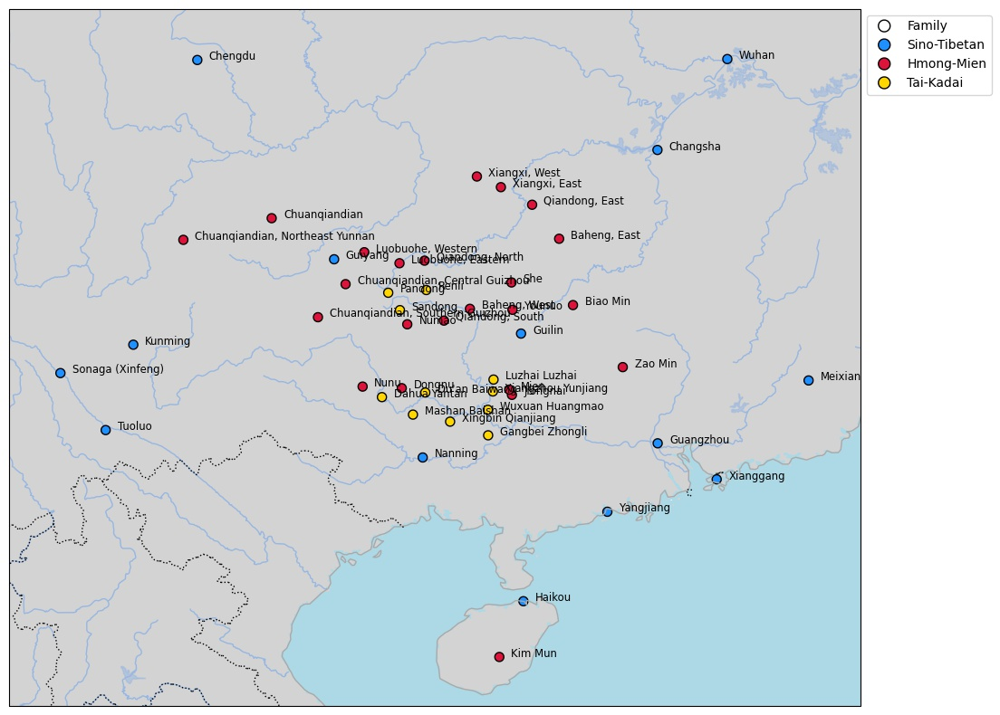
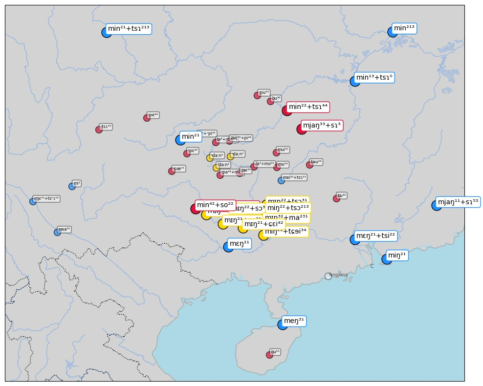
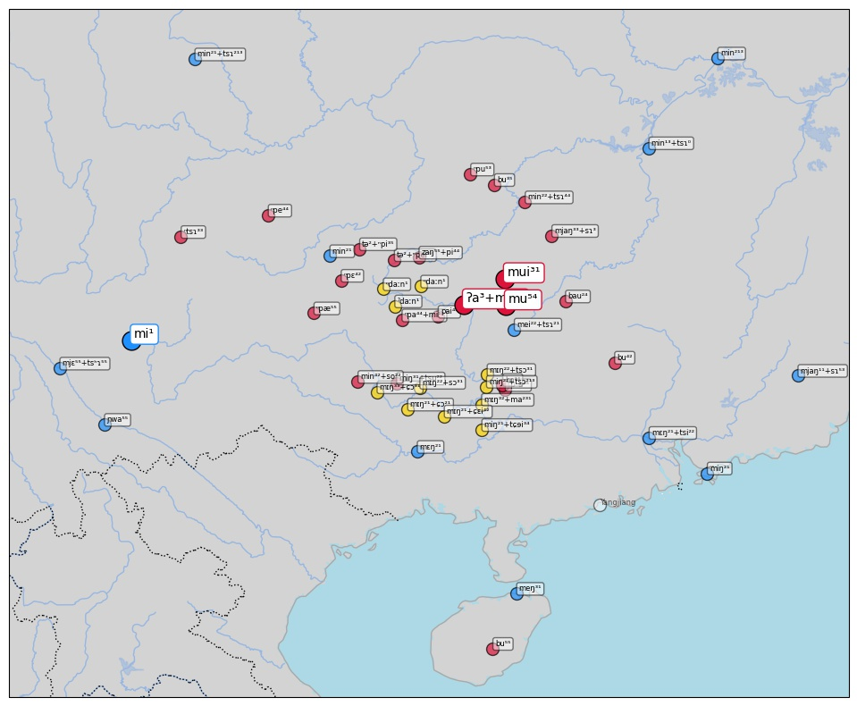
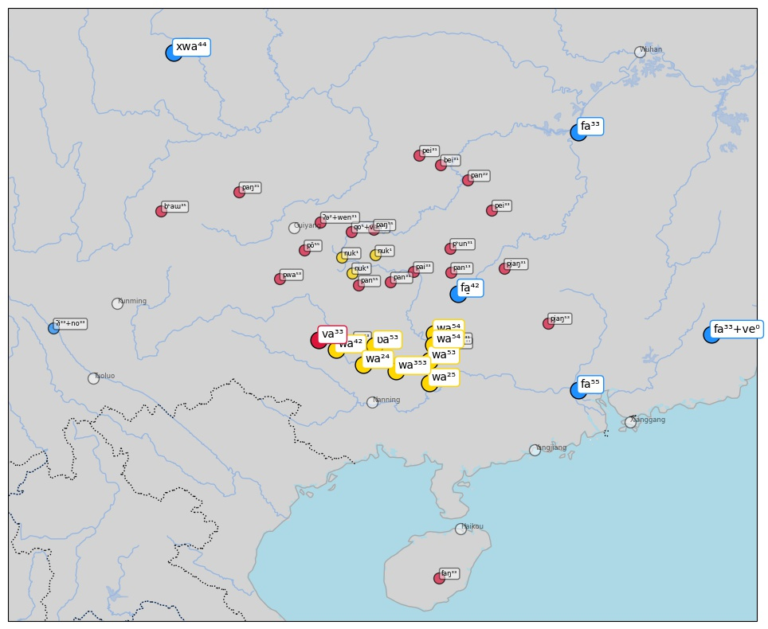

# Reproducing the study

1. Install dependencies:
   ```shell
   pip install -e .
   ```
   Specific installation procedures for [cartopy](https://scitools.org.uk/cartopy/docs/latest/) and [igraph](https://igraph.org) may be necessary, since both packages require non-Python packages to be installed on your system.
2. Optionally fetch raw data from EDICTOR:
   ```shell
   $ cldfbench download lexibank_seabor.py
   INFO    running _cmd_download on borrowing-detection-study ...
   ID             Source                        Varieties    Concepts
   -------------  --------------------------  -----------  ----------
   beidasinitic   Běijīng Dàxué (1964)                  6         146
   beidazihui     Běijīng Dàxué (1962)                  4         171
   castrosui      Castro and Pan (2015)                 3         211
   castroyi       Castro et al. (2010)                  1         222
   castrozhuang   Castro and Hansen (2010)              8         243
   chenhmongmien  Chén (2012)                          23         250
   housinitic     Hóu (2004)                           10          61
   houzihui       Hóu (2004)                            9          77
   liusinitic     Liú Lìlǐ 刘俐李 et al. (2007)            5         130
   wangbai        Wang (2004)                           1         144
   INFO    ... done borrowing-detection-study [1.0 secs]
   ```
3. Create the CLDF dataset augmented with automatically inferred attributes:
   ```shell
   $ cldfbench lexibank.makecldf lexibank_seabor.py --glottolog-version v4.4 --concepticon-version v2.5.0 --clts-version v2.1.0
   ...
   method                           precision    recall    f-score
   -----------------------------  -----------  --------  ---------
   automated cognate detection         0.9032    0.8650     0.8837
   automated borrowing detection       0.9134    0.8204     0.8644
   ...
   ```
   The resulting CLDF dataset is described in its [README](cldf/README.md).

   This will take a couple of minutes. To use the default random seed, just hit
   enter when prompted for it.

   In order to guarantee access to the reference catalogs ([Glottolog](https://glottolog.org), [Concepticon](https://concepticon.clld.org) and [CLTS](https://clts.clld.org)), please follow the installation instructions for the [pylexibank package](https://github.com/lexibank/pylexibank), or see the [instructions for cldfbench](https://github.com/cldf/cldfbench/#catalogs), which provide more detail. 

4. Now we can plot the varieties on a map (see Figure 1):
   ```shell
   $ cldfbench seabor.plotlanguages
   ```
   

5. Recreate the "admixture" plot:
   ```shell
   $ cldfbench seabor.piecharts
   ```
   

6. And plot xenolog clusters for selected concepts:
   - ```shell
     $ cldfbench seabor.plotmaps --concepts name
     ```
     
     
   - ```shell
     $ cldfbench seabor.plotmaps --concepts flower
     ```
     
   - ```shell
     $ cldfbench seabor.plotmaps --concepts correctright
     ```
     
     
     

7. And you can also check for the significance with respect to the stability of certain concept lists.
   ```shell
   $ cldfbench seabor.distribution --conceptlist Swadesh-1955-100 --runs 10000 --seed 1234
   Conceptlist            Proportion of Non-Borrowed Items    Number of Items
   -------------------  ----------------------------------  -----------------
   Swadesh-1955-100                                   0.80                 78
   != Swadesh-1955-100                                0.70                172
   Significance: 0.0038 (0.0975)   

   $ cldfbench seabor.distribution --conceptlist Tadmor-2009-100 --runs 10000 --seed 1234
   Conceptlist           Proportion of Non-Borrowed Items    Number of Items
   ------------------  ----------------------------------  -----------------
   Tadmor-2009-100                                   0.78                 61
   != Tadmor-2009-100                                0.72                189
   Significance: 0.0660 (0.0609)

   $ cldfbench seabor.distribution
   Conceptlist      Proportion of Non-Borrowed Items    Number of Items
   -------------  ----------------------------------  -----------------
   All items                                    0.73                250
   ```
   Note that the results may slightly differ if a different random seed is passed in.

