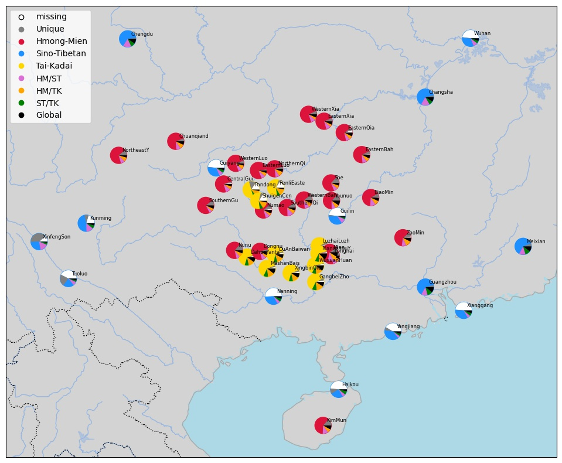
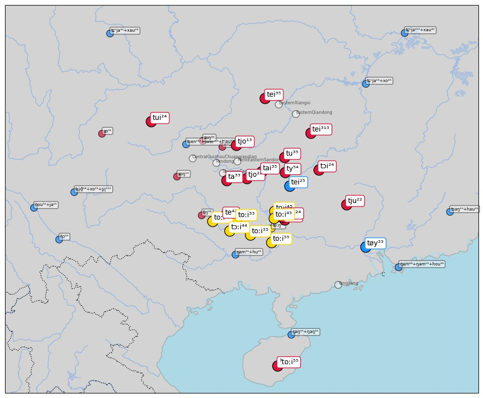

# Reproducing the study

1. Install dependencies:
   ```shell
   pip install -e .
   ```
   Specific installation procedures for [cartopy](https://scitools.org.uk/cartopy/docs/latest/) and [igraph](https://igraph.org) may be necessary, since both packages require non-Python packages to be installed on your system.
2. Optionally fetch raw data from EDICTOR:
   ```shell
   $ cldfbench download lexibank_seabor.py
   INFO    running _cmd_download on borrowing-detection-study ...
   ID             Source                        Varieties    Concepts
   -------------  --------------------------  -----------  ----------
   beidasinitic   Běijīng Dàxué (1964)                  6         146
   beidazihui     Běijīng Dàxué (1962)                  4         171
   castrosui      Castro and Pan (2015)                 3         211
   castroyi       Castro et al. (2010)                  1         222
   castrozhuang   Castro and Hansen (2010)              8         243
   chenhmongmien  Chén (2012)                          23         250
   housinitic     Hóu (2004)                           10          61
   houzihui       Hóu (2004)                            9          77
   liusinitic     Liú Lìlǐ 刘俐李 et al. (2007)            5         130
   wangbai        Wang (2004)                           1         144
   INFO    ... done borrowing-detection-study [1.0 secs]
   ```
3. Create the CLDF dataset augmented with automatically inferred attributes:
   ```shell
   $ cldfbench lexibank.makecldf lexibank_seabor.py --glottolog-version v4.4 --concepticon-version v2.5.0 --clts-version v2.1.0
   ...
   method                           precision    recall    f-score
   -----------------------------  -----------  --------  ---------
   automated cognate detection         0.9032    0.8650     0.8837
   automated borrowing detection       0.9134    0.8204     0.8644
   ...
   ```
   The resulting CLDF dataset is described in its [README](cldf/README.md).

   This will take a couple of minutes. To use the default random seed, just hit
   enter when prompted for it.

   In order to guarantee access to the reference catalogs ([Glottolog](https://glottolog.org), [Concepticon](https://concepticon.clld.org) and [CLTS](https://clts.clld.org)), please follow the installation instructions for the [pylexibank package](https://github.com/lexibank/pylexibank), or see the [instructions for cldfbench](https://github.com/cldf/cldfbench/#catalogs), which provide more detail. 

3. Compare the results with those obtained for different methods (see General Results section and Figure 4):

   ```
   $ cldfbench seabor.fullcomparison

     Threshold      P1      R1      F1      P2      R2      F2     
   -----------  ------  ------  ------  ------  ------  ------
        0.0500  0.9986  0.3977  0.5688  0.9860  0.6902  0.8120
        0.1000  0.9955  0.5434  0.7031  0.9493  0.7499  0.8379
        0.1500  0.9918  0.5859  0.7366  0.9269  0.7824  0.8485
        0.2000  0.9859  0.6008  0.7466  0.9150  0.7883  0.8470
        0.2500  0.9743  0.6381  0.7712  0.8789  0.8062  0.8410
        0.3000  0.9456  0.6782  0.7899  0.8118  0.8267  0.8192
        0.3500  0.9161  0.7415  0.8196  0.7453  0.8669  0.8015
        0.4000  0.8712  0.8194  0.8445  0.6371  0.9030  0.7471
        0.4500  0.8292  0.8566  0.8426  0.5485  0.9248  0.6886
        0.5000  0.8111  0.8706  0.8398  0.5138  0.9323  0.6625
        0.5500  0.7610  0.9255  0.8353  0.4279  0.9560  0.5912
        0.6000  0.7009  0.9530  0.8077  0.3482  0.9672  0.5121
        0.6500  0.6231  0.9764  0.7607  0.2614  0.9820  0.4129
        0.7000  0.6030  0.9894  0.7493  0.2370  0.9873  0.3822
        0.7500  0.5805  0.9959  0.7334  0.2036  0.9925  0.3379
        0.8000  0.5705  0.9990  0.7262  0.1917  0.9986  0.3217
        0.8500  0.5680  0.9990  0.7242  0.1878  0.9986  0.3161
        0.9000  0.5680  0.9990  0.7242  0.1878  0.9986  0.3161
        0.9500  0.5680  0.9990  0.7242  0.1878  0.9986  0.3161

   $ cldfbench seabor.fullcomparison --lexstat

     Threshold      P1      R1      F1      P2      R2      F2   
   -----------  ------  ------  ------  ------  ------  ------
        0.0500  1.0000  0.2584  0.4107  1.0000  0.6605  0.7955
        0.1000  1.0000  0.2922  0.4522  1.0000  0.6605  0.7955
        0.1500  0.9998  0.3292  0.4953  1.0000  0.6605  0.7955
        0.2000  0.9997  0.3728  0.5431  1.0000  0.6610  0.7959
        0.2500  0.9991  0.4180  0.5894  0.9987  0.6664  0.7994
        0.3000  0.9975  0.4836  0.6514  0.9933  0.6822  0.8089
        0.3500  0.9945  0.5542  0.7117  0.9819  0.7031  0.8195
        0.4000  0.9903  0.6175  0.7607  0.9666  0.7418  0.8394
        0.4500  0.9796  0.6776  0.8011  0.9382  0.7868  0.8559
        0.5000  0.9634  0.7484  0.8424  0.8815  0.8327  0.8564
        0.5500  0.9352  0.8053  0.8654  0.8101  0.8716  0.8397
        0.6000  0.8955  0.8468  0.8705  0.7317  0.9001  0.8072
        0.6500  0.8488  0.8846  0.8663  0.6424  0.9273  0.7590
        0.7000  0.8062  0.9183  0.8586  0.5497  0.9422  0.6943
        0.7500  0.7621  0.9442  0.8434  0.4639  0.9622  0.6260
        0.8000  0.7064  0.9688  0.8171  0.3725  0.9754  0.5391
        0.8500  0.6592  0.9803  0.7883  0.3083  0.9830  0.4694
        0.9000  0.6224  0.9928  0.7651  0.2699  0.9939  0.4245
        0.9500  0.5902  0.9964  0.7413  0.2244  0.9966  0.3663


   $ cldfbench seabor.fullcomparison -- partial

     Threshold      P1      R1      F1      P2      R2      F2
   -----------  ------  ------  ------  ------  ------  ------
        0.0500  0.9830  0.4304  0.5987  0.9589  0.7021  0.8106
        0.1000  0.9574  0.6265  0.7574  0.8476  0.7833  0.8142
        0.1500  0.9476  0.6811  0.7925  0.8058  0.8213  0.8134
        0.2000  0.9421  0.6968  0.8011  0.7926  0.8281  0.8100
        0.2500  0.9302  0.7283  0.8170  0.7580  0.8454  0.7993
        0.3000  0.8887  0.7681  0.8240  0.6774  0.8672  0.7606
        0.3500  0.8662  0.8577  0.8619  0.6001  0.9231  0.7273
        0.4000  0.8285  0.8927  0.8594  0.5193  0.9401  0.6690
        0.4500  0.7937  0.9103  0.8480  0.4675  0.9517  0.6270
        0.5000  0.7718  0.9211  0.8399  0.4362  0.9584  0.5995
        0.5500  0.7404  0.9315  0.8250  0.3958  0.9639  0.5612
        0.6000  0.7051  0.9437  0.8071  0.3537  0.9722  0.5187
        0.6500  0.6208  0.9691  0.7568  0.2578  0.9835  0.4085
        0.7000  0.6136  0.9734  0.7527  0.2468  0.9852  0.3947
        0.7500  0.5789  0.9945  0.7318  0.2008  0.9919  0.3340
        0.8000  0.5696  0.9975  0.7252  0.1894  0.9977  0.3183
        0.8500  0.5688  0.9987  0.7248  0.1884  0.9986  0.3170
        0.9000  0.5688  0.9987  0.7248  0.1884  0.9986  0.3170
        0.9500  0.5688  0.9987  0.7248  0.1884  0.9986  0.3170

   $ cldfbench seabor.fullcomparison --lexstat --partial
   
     Threshold      P1      R1      F1      P2      R2      F2        
   -----------  ------  ------  ------  ------  ------  ------
        0.0500  0.9993  0.2677  0.4223  1.0000  0.6605  0.7955
        0.1000  0.9977  0.3068  0.4693  0.9999  0.6605  0.7955
        0.1500  0.9949  0.3607  0.5294  0.9992  0.6613  0.7959
        0.2000  0.9900  0.4172  0.5870  0.9965  0.6650  0.7977
        0.2500  0.9823  0.4877  0.6518  0.9865  0.6793  0.8045
        0.3000  0.9730  0.5763  0.7239  0.9650  0.7066  0.8158
        0.3500  0.9618  0.6658  0.7869  0.9135  0.7532  0.8256
        0.4000  0.9502  0.7404  0.8323  0.8541  0.8074  0.8301
        0.4500  0.9313  0.8032  0.8625  0.7772  0.8550  0.8143
        0.5000  0.9077  0.8628  0.8847  0.7163  0.8956  0.7960
        0.5500  0.8788  0.9027  0.8906  0.6382  0.9227  0.7545
        0.6000  0.8427  0.9189  0.8792  0.5815  0.9455  0.7201
        0.6500  0.8061  0.9306  0.8639  0.5015  0.9568  0.6581
        0.7000  0.7661  0.9380  0.8434  0.4393  0.9639  0.6035
        0.7500  0.7306  0.9472  0.8249  0.3965  0.9733  0.5634
        0.8000  0.6993  0.9563  0.8078  0.3525  0.9747  0.5178
        0.8500  0.6588  0.9657  0.7833  0.3054  0.9772  0.4654
        0.9000  0.6183  0.9751  0.7567  0.2569  0.9845  0.4074
        0.9500  0.5965  0.9865  0.7435  0.2329  0.9918  0.3773
   ```

4. Now we can plot the varieties on a map (see Figure 1):
   ```shell
   $ cldfbench seabor.plotlanguages
   ```
   

5. Recreate the "admixture" plot:
   ```shell
   $ cldfbench seabor.piecharts
   ```
   

6. And plot xenolog clusters for selected concepts:
   - ```shell
     $ cldfbench seabor.plotmaps --concepts name
     ```
     
     
   - ```shell
     $ cldfbench seabor.plotmaps --concepts flower
     ```
     
   - ```shell
     $ cldfbench seabor.plotmaps --concepts correctright
     ```
     
     
     

7. And you can also check for the significance with respect to the stability of certain concept lists.
   ```shell
   $ cldfbench seabor.distribution --conceptlist Swadesh-1955-100 --runs 10000 --seed 1234
   Conceptlist            Proportion of Non-Borrowed Items    Number of Items
   -------------------  ----------------------------------  -----------------
   Swadesh-1955-100                                   0.80                 78
   != Swadesh-1955-100                                0.70                172
   Significance: 0.0038 (0.0975)   

   $ cldfbench seabor.distribution --conceptlist Tadmor-2009-100 --runs 10000 --seed 1234
   Conceptlist           Proportion of Non-Borrowed Items    Number of Items
   ------------------  ----------------------------------  -----------------
   Tadmor-2009-100                                   0.78                 61
   != Tadmor-2009-100                                0.72                189
   Significance: 0.0660 (0.0609)

   $ cldfbench seabor.distribution
   Conceptlist      Proportion of Non-Borrowed Items    Number of Items
   -------------  ----------------------------------  -----------------
   All items                                    0.73                250
   ```
   Note that the results may slightly differ if a different random seed is passed in.

